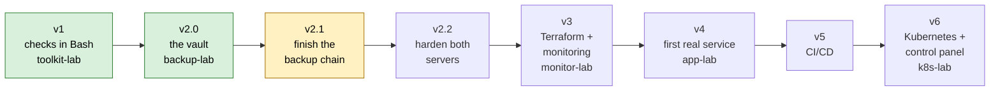

# Roadmap

What each version builds, how it is tested, and why it comes in that order.
The README holds the short table; this page is the reference.

Green: done. Yellow: next.

## How a Version Is Decided

1. **One goal**, in one sentence.
2. **One exit gate**: a test on the real machines that proves the goal.
3. **Order by need**: a version comes after everything it depends on.
4. **An item joins a version only if it serves that goal** and fixes a real
   problem in this lab. Anything else waits as a later improvement, or is
   dropped.

## v2.1: Finish the backup chain

**Goal:** every backup can be restored, and no part of the chain can fill up or
break unseen.

- Retention for the local copy on `toolkit-lab`; it never removes a backup that
  was not sent yet.
- A size limit on `incoming`, so a compromised sender cannot fill the data disk.
- The vault mover checked by the CI, like the other scripts.
- An automatic restore test: a backup taken from the vault, unpacked and
  compared with its checksum.

**Exit gate:** a backup restored from the vault matches its checksum; the local
folder stays bounded; `incoming` refuses data past its limit; the CI checks the
mover.

**Why first:** v2.2 changes the chain (encryption, an immutable vault). The
restore test of v2.1 is what proves those changes broke nothing.

## v2.2: Harden both servers

**Goal:** each server accepts only what it needs, and every change is measured
against a standard.

- A firewall policy written in the repo: who may connect in, and where each
  machine may connect out; everything else refused, both ways.
- The policy applied when a machine is built (the template for `backup-lab`, a
  setup step for `toolkit-lab`).
- `firewall-check.sh` compares the live rules with the policy, and checks that
  `ufw` is enabled and running. It reports; it never changes the firewall.
- SSH off port 22.
- The code that root runs moved out of `/home/ghaith` to `/usr/local/sbin`:
  today `ghaith` can edit two scripts that root runs, and the library they
  load.
- systemd sandboxing on the units.
- Encryption before sending; the vault made immutable (`chattr +i`).
- `noexec,nodev,nosuid` on `/srv/backup`; automatic security updates.
- Smaller items: the empty CD-ROM drive removed, the image checked with
  `gpgv`, the libvirt `clean-traffic` filter, a time limit on the unlocked
  admin key.
- A CIS audit report before and after.

**Exit gate:** the CIS report shows the change; `firewall-check.sh` passes on
both servers; a connection the policy does not allow is refused, in and out;
SSH works from the allowed machines on the new port; only the expected ports
listen; the v2.1 restore test still passes.

**Decided at the start:** the SSH port; the outgoing allow list of each
machine; whether admin access becomes console-only (the final check of
`bootstrap.sh` logs in with the admin key).

## v3: Infrastructure as code and monitoring

**Goal:** new machines are built from code, and every machine is watched.

- Terraform (libvirt provider) builds `monitor-lab`. `backup-lab` stays with
  `bootstrap.sh`: no tool that can delete gets near the vault's disk.
- Prometheus on `monitor-lab`, `node_exporter` on every machine, Grafana and
  alerts; Grafana opened from the host's browser, its port open to the host only.
- The results compared with what the v1 checks report.

**Exit gate:** `monitor-lab` destroyed and rebuilt from code; a stopped service
raises an alert; Grafana shows every machine.

**Decided at the start:** where Terraform's state lives, and where alerts go.

**Why here:** the next machines are built with Terraform, and are watched from
the day they start.

## v4: The first real service

**Goal:** a service that is used every day runs in containers, and its data is
protected by the vault.

- `app-lab` built by Terraform.
- Readeck with PostgreSQL in Docker Compose.
- A database backup sent to the vault; the vault accepts more than one sender
  (`bootstrap.sh` and the template change for this).
- A copy of Terraform's state sent to the vault.

**Exit gate:** `app-lab` deleted, rebuilt from code, its data restored from the
vault, the saved articles back.

## v5: CI/CD

**Goal:** a change pushed to GitHub is tested and deployed to the lab with no
manual step.

- A pipeline: test, build, deploy to `app-lab`.

**Exit gate:** a commit changes the running service on its own; a failing test
stops the deploy.

**Decided at the start:** how GitHub reaches a lab behind NAT.

## v6: Kubernetes and the control panel

**Goal:** the service runs on a cluster, managed from one place.

- A cluster: `k8s-lab` (control plane) and `app-lab` (worker).
- Readeck moved to the cluster, its data restored from the vault.
- The v5 pipeline deploys to the cluster.
- A control panel inside the lab, opened from the host's browser.

**Exit gate:** Readeck runs on the cluster with its old articles; a commit
reaches it through the pipeline.

**Decided at the start:** kubeadm or k3s (the host has 15 GiB of RAM).

## After v6

Improvements come as v6.x releases. A cloud version (v7) comes once the lab is
complete.

## Not on the Roadmap, and Why

| Item | Why not |
|---|---|
| `secaudit.sh` | The CIS audit of v2.2 checks file permissions and `auditd` with a standard tool. |
| Automatic IP blocking with `ufw` | After v2.2 only known machines reach SSH: nothing is left to block. |
| An expected-ports list in `hostaudit.sh` | The v2.2 exit gate checks the listening ports. |
| An exclude flag for `backup.sh` | The backup is meant to hold the whole repo, `.git` included. |
| IPv6 and rotated logs in `log-analyzer.sh`, a random delay on the timers | Known v1 limits ([NOTES.md](NOTES.md)); small fixes, made when those scripts are next touched. |
| An offline USB copy | A later improvement; the shared disk stays a known limit. |
| A RHEL-family machine, Ubuntu 26.04 | To be discussed on their own, later. |
